# 📄 Product Requirements Document (PRD): Diskarte Clipping
**Document Version:** 2.0.0  
**Project:** Diskarte Clipping Web Platform & Dual-Sided Distribution Engine  
**Reference Blueprint:** ClippingCulture.com Analysis & Operational Model  
**Visual Brand Identity:** `diskarteClippingLogo.jpg` (Philippine 8-Ray Sun, Gold Play Core, Royal Blue & Crimson Accents on Matte Obsidian Canvas)  
**Target Launch:** Q3 2026  

---

## 1. Executive Summary & Core Value Proposition

### 1.1 Brand Vision & Philosophy
**"Diskarte"** is the Filipino ethos of strategic agility, tactical ingenuity, street-smart resourcefulness, and relentless execution. **Diskarte Clipping** turns this cultural edge into a world-class, dual-sided viral distribution powerhouse.

Unlike traditional creative agencies that charge hefty monthly retainers for a handful of paid ad creatives, or standard editing freelancers who leave distribution entirely to the client, **Diskarte Clipping** operates an end-to-end managed distribution network. We orchestrate thousands of skilled, independent video clippers who transform long-form content (podcasts, livestreams, songs, brand announcements, gameplays) into millions of organic, algorithmic impressions across **TikTok, Instagram Reels, and YouTube Shorts**.

```
                           ┌─────────────────────────────────────────┐
                           │            DISKARTE CLIPPING            │
                           │   Dual-Engine Managed Distribution Net  │
                           └─────────────────────────────────────────┘
                                                │
                 ┌──────────────────────────────┴──────────────────────────────┐
                 ▼                                                             ▼
     ┌───────────────────────┐                                     ┌───────────────────────┐
     │    FOR BRANDS / CPS   │                                     │  FOR CLIPPERS / EDITORS│
     ├───────────────────────┤                                     ├───────────────────────┤
     │ • Managed Campaigns   │                                     │ • No Follower Minimums│
     │ • 1–2 Day Rapid Launch│                                     │ • Pay per 1K Views    │
     │ • 100% Human Review QA│                                     │ • Whop Portal Bounties│
     │ • Verified Reporting  │                                     │ • Fast Direct Payouts │
     │ • Custom Scope/Quote  │                                     │ • Whop.com Integration│
     └───────────────────────┘                                     └───────────────────────┘
```

### 1.2 Dual Mission: Solving Both Sides of the Market
1. **For Brands, Artists, Startups, & Creators**: Deliver massive, culture-defining organic visibility without the ad-fatigue or high CPMs of traditional paid media. Direct inquiries to: `diskarteclipping@gmail.com`.
2. **For Individual Video Editors & Clippers Worldwide**: Provide an open, meritocratic earning ecosystem where anyone with video editing skills can get paid a fixed rate per 1,000 verified views with **zero follower minimums**.

---

## 2. Visual Design System (Derived from Brand Logo)

Directly mapped from [diskarteClippingLogo.jpg](file:///c:/Users/yeojl/Documents/Projects/Personal%20Projects/Projects/Websites/Diskarte%20Clipping/diskarteClippingLogo.jpg):

```
       [ Deep Obsidian Canvas: #070A0F ]  ──  [ Matte Dark Cards: #0F1420 ]
                        │
         ┌──────────────┼──────────────┬──────────────┐
         ▼              ▼              ▼              ▼
 ┌───────────────┐ ┌─────────────┐ ┌─────────────┐ ┌─────────────┐
 │ Imperial Gold │ │ Royal Blue  │ │ Crimson Red │ │ Pure White  │
 │    #E5B842    │ │   #0055FE   │ │   #EF4444   │ │   #FFFFFF   │
 │ (Sun Ray Core)│ │ (Tech/Trust)│ │ (Viral/Live)│ │ (Headlines) │
 └───────────────┘ └─────────────┘ └─────────────┘ └─────────────┘
```

### 2.1 Dual Theme System (Dark & Light Mode via Shadcn UI Architecture)

The interface supports seamless Dark / Light mode switching powered by **Shadcn UI** design tokens (HSL variables) with instant persistence:

```
┌────────────────────────────────────────────────────────────────────────────────────────┐
│                                 SHADCN THEME TOKENS                                    │
├───────────────────────────────┬────────────────────────────────────────────────────────┤
│ Token Parameter               │ Dark Mode (Default Obsidian)   │ Light Mode (Clean Slate)│
├───────────────────────────────┼────────────────────────────────┼───────────────────────┤
│ `--background`                │ `222 47% 4%` (#070A0F)         │ `0 0% 100%` (#FFFFFF) │
│ `--foreground`                │ `210 40% 98%` (#F8FAFC)        │ `222 47% 11%` (#0A1628)
│ `--card`                      │ `222 47% 7%` (#0F1420)         │ `0 0% 100%` (#FFFFFF) │
│ `--card-foreground`           │ `210 40% 98%`                  │ `222 47% 11%`         │
│ `--primary` (Imperial Gold)   │ `43 78% 58%` (#E5B842)         │ `43 85% 48%` (#D4AF37)│
│ `--primary-foreground`        │ `222 47% 4%` (#070A0F)         │ `0 0% 100%` (#FFFFFF) │
│ `--secondary` (Royal Blue)    │ `221 100% 50%` (#0055FE)       │ `221 100% 50%` (#0055FE)
│ `--destructive` (Crimson Sun) │ `0 84% 60%` (#EF4444)          │ `0 84% 60%` (#EF4444) │
│ `--border`                    │ `222 30% 18%` (rgba)           │ `214 32% 91%` (rgba)  │
│ `--ring`                      │ `43 78% 58%` (Gold Glow)       │ `43 85% 48%`          │
└───────────────────────────────┴────────────────────────────────┴───────────────────────┘
```

- **Dark Mode (Default)**: Deep obsidian canvas with glowing golden sunbursts, frosted dark glass cards, and high-contrast typography.
- **Light Mode (Clean Editorial)**: Pure crisp white and warm slate-zinc canvas (modeled directly after Clipping Culture's clean editorial landing surface) paired with deep navy headings (`#0A1628`) and royal gold accents.
- **Micro-Interaction**: Animated Sun/Moon toggle with radial icon spin and smooth 300ms CSS color transitions across all components.
- **Typography Hierarchy**:
  - Primary Display Sans: `Plus Jakarta Sans` or `Syne` (Bold, geometric, premium)
  - Dynamic Accent Serif: `Georgia` / `Instrument Serif` (Italic, matching Clipping Culture's rotating headline words)
  - Body & Data: `Inter` with tabular numbers for accurate view tracking displays

---

## 3. Brand vs. Alternatives: Clipping vs. Paid Ads & Freelancers

| Evaluation Metric | Paid Ads (Meta/TikTok Ads) | Freelance Video Editors | Diskarte Clipping Engine |
| :--- | :--- | :--- | :--- |
| **How It Works** | Buying sponsored ad placements | Paying per edited `.mp4` file | **Campaign bounties distributed across 100K+ creator accounts** |
| **Viewer Perception** | "Sponsored" tag (High ad-blindness) | None (Client must upload) | **100% native algorithmic content from independent creators** |
| **Cost Model** | Volatile auction CPMs ($15–$40 CPM) | Fixed hourly / per-clip cost | **Target verified-view volume pricing (Inquiries: diskarteclipping@gmail.com)** |
| **Speed to Scale** | Requires continuous ad-spend | Bottlenecked by 1–2 editors | **Hundreds of clips live within 1–2 days of launch** |
| **Account Risk** | Single ad-account ban halts all | No distribution | **Decentralized network; zero risk to client primary account** |
| **Quality Control** | Ad manager rules | Hit-or-miss | **Human review on every single live submission before payout** |

---

## 4. Complete Information Architecture & Page Blueprint

```mermaid
graph TD
    A[Diskarte Clipping Home] --> B[Top Floating Navigation]
    A --> C[Dynamic Hero with Live Proof Badges]
    A --> D[Interactive Video Showreel Player & Media Logos]
    A --> E[Dual Value Proposition: Brands vs. Clippers]
    A --> F[4-Step Managed Agency Engine]
    A --> G[Vertical Solutions: Music, Podcasts, Brands, Gaming]
    A --> H[Clipper Earning & Community Portal Hub]
    A --> I[Clipping vs. Paid Ads Comparison Matrix]
    A --> J[Transparent Pricing & Scope Breakdown]
    A --> K[Comprehensive FAQ & Brand Safety Accordion]
    A --> L[Floating Footer & Call Booking Modal]

    A --> M[Subpages & Portals]
    M --> M1[Case Studies Directory /casestudies]
    M --> M2[Brand Onboarding /work-with-us]
    M --> M3[Clipper Community & Whop /clippers]
    M --> M4[Comparison Guide /compare]
    M --> M5[Contact & Booking /contact]
```



---

## 5. Detailed Section Specifications

### 5.1 Floating Glass Navigation Bar
- **Logo**: 3D Sun Icon + "Diskarte Clipping" text badge.
- **Brand Nav Links**:
  - **Work With Us** (For brands, labels, podcasters)
  - **Case Studies** (Verified campaign results)
  - **How It Works** (The 4-step managed workflow)
  - **Join as a Clipper** (Dedicated portal for editors)
  - **Compare** (Clipping vs. Paid Ads)
  - **FAQ**
- **Action CTA & Theme Toggle**:
  - **Shadcn Theme Toggle Button**: Sun / Moon icon button with animated rotation and instant localStorage state persistence.
  - **Primary CTA**: Golden pill button with arrow `[Book a Call ↗]` (Opens instant scheduler modal).

---

### 5.2 Dynamic Hero Section (Culture-Defining Impact)
- **Top Proof Pill**:
  - Overlapping client/campaign avatars + Text: *"The Aspiring Managed Clipping Agency Powering Viral Campaigns"*.
  - Sub-badge: *Targeting millions of verified views*.
- **Kinetic Headline**:
  - Line 1: `CLIPPING` + dynamic rotating serif text (*`CAMPAIGNS`*, *`MOMENTS`*, *`CULTURE`*).
  - Line 2: `THAT MOVE CULTURE & DRIVE GROWTH`.
- **Sub-headline**: "The aspiring managed clipping agency built for explosive organic distribution for podcasters, music artists, creators, and high-growth brands. Powered by a hungry network of skilled clippers, 100% human submission reviews, and verified view reporting."
- **Dual CTA Buttons**:
  - Primary: `[Book a Call ↗]` (Imperial Gold glow button)
  - Secondary: `[See How It Works ↗]` (Glass outline button)
- **Public Review Trust Anchor**: 5-Star rating badge (*"Rated 4.9/5 across community clippers & client campaigns"*).

---

### 5.3 Interactive Whop Format Showcase & Media Wall
- **Whop Format Blueprints**:
  - Responsive vertical video container styled like a high-end mobile feed with sound unmute toggle, ambient glow, and direct *"Clip This on Whop"* button.
  - Category selector tabs: *🎵 Music Hooks*, *🎙️ Podcast Snippets*, *🎮 Gaming Highlights*, *🚀 Product Demos*.
  - Strong call-to-actions driving video clippers directly to `https://whop.com/clippingculture/` to claim bounties.
- **Featured Press Ticker**:
  - Seamless infinite marquee of media mentions: *Forbes, NPR, CNN, 12News, Variety, The Hollywood Reporter, Business Insider*.

---

## 5.4 The 4-Step Managed Agency Workflow (Speed & Safety)
1. **Step 1: Campaign Brief & Source Asset Ingestion**
   - We extract winning clips, hooks, and audio from your approved source footage, music catalog, podcasts, or livestreams.
   - Set strict brand guardrails, banned topics, and required calls-to-action/tags.
2. **Step 2: Rapid Clipper Mobilization (1–2 Days Turnaround)**
   - Campaign launches immediately to our network of thousands of vetted clippers.
   - Content bounties go live with clear payout rates per 1,000 verified views.
3. **Step 3: 100% Human Review & Brand Safety Screening**
   - Every submitted clip is manually reviewed by moderators before approval.
   - Verification of hashtags, sound usage, watermarks, and accurate messaging.
4. **Step 4: Algorithmic Flood & Verified View Reporting**
   - Hundreds of synchronized creator accounts post across TikTok, Reels, and Shorts.
   - Clients receive live, transparent reporting tracking only real, verified organic views.

---

## 5.5 Target Verticals & Use Cases
- **Music Labels & Independent Artists**: Fuel trending sounds on TikTok and drive viral spikes into Spotify / Apple Music charts.
- **Podcasters & Broadcasters**: Turn 2-hour episodes into dozens of viral micro-moments that pull subscribers into full episodes.
- **Startups, SaaS & Consumer Brands**: High-velocity organic product discovery and mobile app installs without ad burn.
- **Gaming Teams & Streamers**: Clip intense match moments, funny fails, and tournament highlights to grow community fandom.
- **CEOs & Personal Brands**: Build omnipresence and thought leadership across social feeds.

---

## 5.6 Dedicated Clipper & Creator Hub ("Join via Whop")
A dedicated section and subpage breaking down the creator side of the ecosystem:
- **Zero Follower Minimum**: Anyone can join and start posting. Payouts are based purely on verified video performance.
- **Clear Earnings**: Earn a guaranteed set rate per 1,000 verified views.
- **Access to Top Brand Bounties**: Clip for global musicians, top podcasters, and famous brands.
- **Whop Integration**: Direct access via [whop.com/clippingculture/](https://whop.com/clippingculture/) for community leaderboard, guidelines, asset banks, and instant payouts.
- **CTA**: `[Join as a Clipper on Whop (https://whop.com/clippingculture/) ↗]`.

---

### 5.7 Campaign Scope & Inquiries (Direct Email)
- **Direct Campaign Inquiries**: Brands and creators can contact us directly at `diskarteclipping@gmail.com` to receive custom campaign proposals tailored to their target view goals.
- **All-Inclusive Scope**:
  - Dedicated Campaign Manager & Creative Strategist.
  - Source material review and hook curation.
  - Clipper community bounty management and payouts.
  - 100% human moderation on all submissions.
  - Real-time verified analytics dashboard.
  - Multi-platform distribution across TikTok, Instagram Reels, and YouTube Shorts.
- **Who It's For**: Artists, venture-backed startups, podcasters, gaming brands, and creators ready for scalable organic view distribution.

---

### 5.8 Comprehensive FAQ Accordion (Objection Crusher)
- **Q: How does Diskarte Clipping ensure brand safety?**  
  *A: Every single video submitted by our clippers undergoes a mandatory human review to verify guidelines, audio tags, and compliance before any payout is approved.*
- **Q: How fast does a campaign start?**  
  *A: Campaigns typically launch within 1 to 2 days following onboarding and source asset delivery.*
- **Q: How are views verified?**  
  *A: We track live platform analytics through our verification software to ensure only authentic, organic views on eligible posts are counted.*
- **Q: How do we get started?**  
  *A: Email our team directly at `diskarteclipping@gmail.com` with your project links and distribution goals.*
- **Q: How do clippers get paid?**  
  *A: Clippers submit their live URLs to our Whop portal. Once verified, payouts are distributed at a fixed rate per 1,000 views directly via Whop.*
- **Q: What platforms do you distribute to?**  
  *A: TikTok, Instagram Reels, and YouTube Shorts.*

---

### 5.9 High-Converting Sticky Header & Footer CTA
- Dark obsidian card illuminated by an 8-ray golden sunburst.
- Punchy headline: *"Ready to flood the algorithm with millions of verified views?"*
- Primary booking trigger: `[Contact Us via Email (diskarteclipping@gmail.com) ↗]`.
- Secondary creator link: *"Are you an editor? Join our Whop Portal ↗"*.

---

## 6. Technical Stack & SEO Best Practices

- **Core Tech**: HTML5 / Modern Modular JavaScript / React / Next.js.
- **UI Components & Theming**: **Shadcn UI** component primitives (Dialog/Modal, Accordion, Dropdown, Button, Tooltip, Sheet for mobile menu) + `next-themes` / class-based Tailwind CSS HSL variables.
- **Styling Architecture**: Custom CSS Variables & Glassmorphism Design Tokens (Pure responsive CSS with zero bloated dependencies).
- **SEO & Social Optimization**:
  - `title`: `Diskarte Clipping | Managed Short-Form Video Distribution Agency`
  - `meta description`: `Diskarte Clipping is an aspiring managed clipping agency powering viral short-form distribution. 1–2 day rapid launch, 100% human-reviewed submissions, and verified reporting across TikTok, Reels, and Shorts.`
  - OpenGraph image referencing `diskarteClippingLogo.jpg`.
  - Structured Data (JSON-LD) for `Organization`, `Service`, and `FAQPage`.

---

## 7. Execution & Next Steps

1. **Step 1**: Review updated PRD v2.0.0.
2. **Step 2**: Build the responsive web platform adhering to the extracted design tokens and visual blueprint.
3. **Step 3**: Verify all interactive elements (dynamic rotating headline, showreel video player, dual brand/clipper navigation, FAQ accordion, booking modal).
